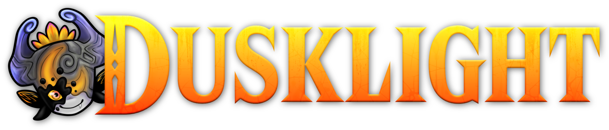
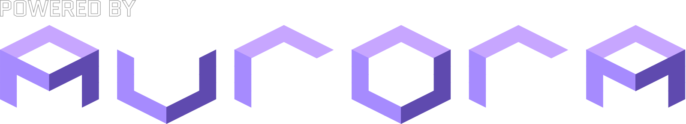

<div align="center">
  

  <p align="center">
    <a href="https://github.com/WadeWinningWilson/A-Link-Between-Dusklight">A Link Between Dusklight on GitHub</a>
  </p>
</div>

# A Link Between Dusklight

**A Link Between Dusklight** is a PC mod for [Dusklight](https://github.com/TwilitRealm/dusklight) — the open-source reimplementation of _The Legend of Zelda: Twilight Princess_ — that adds an _A Link Between Worlds_–style **energy meter**, **death item strip**, **Postman rental shop**, and a suite of optional combat and economy tweaks (shield parry/durability, wolf combat, enemy HP scaling, death rupee orb, enemy death rupees, and more).

> **You must provide your own legal copy of the game.** This repository does not include copyrighted assets.

Inspired by CaptainKittyCa2’s ALBW meter mod work. Base game by [TwilitRealm](https://twilitrealm.dev).

## Features (summary)

| Feature | Status |
|--------|--------|
| ALBW energy meter HUD | ✅ |
| Meter drain (sword, agility, hidden skills) | ✅ |
| Manual shield / parry & bash charges / durability (optional) | ✅ |
| Strip 13 items on Death | ✅ |
| Rupee Recovery Orb — half wallet on death, recover via Tear of Light (optional) | ✅ |
| Postman rental shop + Oocoo dungeon warp | ✅ (shop footer polish WIP) |
| Cycle Z-Targeting | ✅ |
| Wolf Link combat overhaul (optional) | ✅ |
| Enemy HP multipliers — Normal / Mid-Boss / Boss / Final (optional) | ✅ |
| Enemy Wealth + HUD popup (optional) | ✅ |
| Colossal Wallet / final pricing pass | ⏳ |
| Upstream Dusklight v1.3.1 merge | ⏳ |
| Postman shop — heart & ALBW meter upgrades (Master Quest) | ✅ (stamina row icon swap pending) |
| Lockout boomerang — visual ranged-open feedback | ⏳ |
| Enemy HP multiplier — finish true max-HP migration | ⏳ |
| Zant & Ganon finale boss changes | ⏳ |

Full gameplay, settings, and source file list: **[docs/albw-port.md](docs/albw-port.md)** (includes **Next on the docket**).

Latest release notes: **[docs/patch-notes-v0.55.md](docs/patch-notes-v0.55.md)** (v0.55 since v0.5).

---

## Build the mod yourself (Windows)

### 1. Prerequisites

- [CMake 3.25+](https://cmake.org) and **Visual Studio 2022** (or 2026) with **Desktop development with C++**, **CMake Tools**, and **Windows SDK**
- [Python 3](https://www.python.org/) on your `PATH`
- [Git](https://git-scm.com/)

More detail: [docs/building.md](docs/building.md).

### 2. Clone this repository

```powershell
git clone --recursive https://github.com/WadeWinningWilson/A-Link-Between-Dusklight.git
cd A-Link-Between-Dusklight
git submodule update --init --recursive
```

Use `--recursive` on clone (or run `submodule update` after) — required for Aurora and other deps.

### 3. Configure and build

**Recommended** (native letter-select shop + message-window dialogue):

```powershell
cmake --preset windows-msvc-relwithdebinfo -DTARGET_PC_NATIVE_UI=ON
cmake --build --preset windows-msvc-relwithdebinfo
```

**Without** native UI (ImGui shop + toasts for greet/farewell):

```powershell
cmake --preset windows-msvc-relwithdebinfo
cmake --build --preset windows-msvc-relwithdebinfo
```

First build can take a long time.

### 4. Run

Executable:

`build\windows-msvc-relwithdebinfo\dusklight.exe`

Launch from the repo root (or pass your disc image as in [docs/building.md](docs/building.md#running)):

```powershell
.\build\windows-msvc-relwithdebinfo\dusklight.exe --dvd "C:\path\to\your\game.iso"
```

In-game: use the launcher to pick your dump, or use `--dvd` as above.

### 5. Rebuild after code changes

```powershell
cmake --build --preset windows-msvc-relwithdebinfo
```

Re-run `cmake --preset ...` only when you change CMake options (e.g. toggling `TARGET_PC_NATIVE_UI`).

---

## Game setup

1. Dump a supported **GameCube USA or EUR** Twilight Princess image ([Dolphin ripping guide](https://wiki.dolphin-emu.org/index.php?title=Ripping_Games)).
2. Point Dusklight at that file on first run (**Select Disc Image**) or via `--dvd`.

GPU: D3D12, Vulkan, or Metal capable card recommended (see upstream Dusklight notes for older iGPUs).

---

## Building on macOS / Linux

The **A Link Between Dusklight mod code is PC-only** (`#if TARGET_PC`). You can still build vanilla Dusklight from this tree using the presets in [docs/building.md](docs/building.md); the meter and rental systems will not be included on those platforms.

---

# Upstream Dusklight

This repo is a full Dusklight source tree with **A Link Between Dusklight** integrated. For vanilla Dusklight releases, documentation, and community links:

- [TwilitRealm/dusklight](https://github.com/TwilitRealm/dusklight)
- [Official site](https://twilitrealm.dev) · [Discord](https://discord.gg/6NpMhefCK9)

# Credits

- **A Link Between Dusklight:** WadeWinningWilson — [A-Link-Between-Dusklight](https://github.com/WadeWinningWilson/A-Link-Between-Dusklight) (GitHub repo name)
- **Inspired by:** CaptainKittyCa2
- **Dusklight:** [TwilitRealm](https://github.com/TwilitRealm/dusklight) and [contributors](https://github.com/TwilitRealm/dusklight/graphs/contributors)
- **Decomp / Aurora / community:** see upstream [README](https://github.com/TwilitRealm/dusklight/blob/main/README.md) credits

<br/>
<div align="center">
    <a href="https://github.com/encounter/aurora">
        
    </a>
</div>
